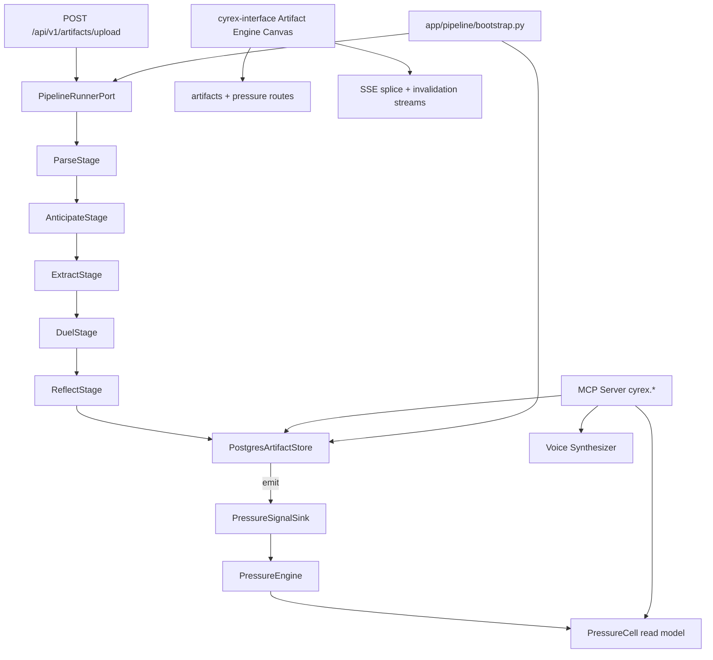

# Cyrex AGI Design Plan v2

**Owner:** DeepIRI  
**Timeline:** **8 weeks total** (2-day pre-track · 4-week parallel build · Week 5 integration gate · Weeks 6–8 Splicing ship)  
**Team:** Prajawala · Sebastian · Evan · Tyler  
**Spec:** `cyrex_artifact_engine_spec-3`  
**Companion docs:**
- [CYREX_AGI_IMPLEMENTATION_PLAN_V2.md](./CYREX_AGI_IMPLEMENTATION_PLAN_V2.md) — per-engineer todos
- [CYREX_AGI_VISUALIZATION_PLAN_V2.md](./CYREX_AGI_VISUALIZATION_PLAN_V2.md) — novel viz primitives & canvas layout
- [CYREX_AGI_POSTGRES_SCHEMA.md](./CYREX_AGI_POSTGRES_SCHEMA.md) — full `cyrex.*` table inventory (~111 tables)
- [CYREX_AGI_PRODUCER_SUBSCRIBER_MAP.md](./CYREX_AGI_PRODUCER_SUBSCRIBER_MAP.md) — live vs planned producer → sink → subscriber wiring

---

## Table of Contents

1. [Executive Summary](#1-executive-summary)
2. [Terminology](#2-terminology)
3. [The AGI Landscape (2026)](#3-the-agi-landscape-2026)
4. [DeepIRI's AGI Thesis](#4-deepiris-agi-thesis)
5. [Splicing — Novel Multi-Agent Memory](#5-splicing--novel-multi-agent-memory)
6. [Cyrex Artifact Engine Architecture](#6-cyrex-artifact-engine-architecture)
7. [Four Frontier Capabilities](#7-four-frontier-capabilities)
8. [Visualization Layer](#8-visualization-layer)
9. [Six-Layer AGI Stack (Industry Alignment)](#9-six-layer-agi-stack-industry-alignment)
10. [AGI RAG + MCP](#10-agi-rag--mcp)
11. [Beyond LangChain](#11-beyond-langchain)
12. [Repo & Library Map](#12-repo--library-map)
13. [cyrex-agi Roadmap (V1–V5)](#13-cyrex-agi-roadmap-v1v5)
14. [Integration Architecture](#14-integration-architecture)
15. [Data Model & Postgres Schema](#15-data-model--postgres-schema)
16. [Producer & Subscriber Architecture](#16-producer--subscriber-architecture)
17. [API & MCP Surface](#17-api--mcp-surface)
18. [Observability & Evaluation](#18-observability--evaluation)
19. [Risk Register](#19-risk-register)

---

## 1. Executive Summary

Cyrex is evolving from a LangChain-orchestrated vendor intelligence platform into a **computed knowledge graph** with four frontier capabilities — and eventually into a testable AGI substrate via **Splicing**.

This design plan covers:

- **Days 1–2:** Pre-track — contract layer merged (all engineers)
- **Weeks 1–4:** Artifact Engine tracks A–D + viz Tier 1 (parallel, overlap everything)
- **Week 5:** Integration gate — E2E green, four capabilities demo on lease doc
- **Weeks 6–7:** Splicing MVP + live viz (VIZ-10–12, 14)
- **Week 8:** Ship + buffer

The step from "AI agent" to "AGI system" is not a bigger model. It is:

1. **Memory that compounds** (artifact store + reckoning priors + learning artifacts)
2. **Autonomy that earns trust** (Bayesian confidence, ghost artifacts, human corrections)
3. **Learning that changes the system** (corrections → Helox fine-tune → modelkit publish)
4. **Coordination with zero stale reads** (Splicing — our novel contribution)

---

## 2. Terminology

### `app/pipeline/contracts/` ≠ contractual/legal intelligence

**Contracts** in this codebase means the **shared type-and-interface layer** between parallel engineering tracks:

| File | Purpose |
|------|---------|
| `app/pipeline/contracts/models.py` | Pydantic schemas: `ArtifactBundle`, `Citation`, `DuelState`, etc. |
| `app/pipeline/contracts/ports.py` | `typing.Protocol` boundaries: `ArtifactStorePort`, `PressureSignalSink`, etc. |
| `app/pipeline/contracts/pressure_events.py` | Discriminated `PressureEvent` union |

Legal/contract document processing remains in `lease_processor.py` / `contract_processor.py`, wrapped as `AbstractDocumentProcessor` inside the pipeline.

### Team roles

| Engineer | Primary domain | Constraint |
|----------|---------------|------------|
| **Tyler** | Track A — Store & Orchestrator | AI + backend |
| **Evan** | Track B — Adversarial + Dead Reckoning | AI + libraries |
| **Prajawala** | Track C — Voice + API + UI | AI + frontend API |
| **Sebastian** | Infra, persistence, CI, MCP hosting, integration shell | **Backend/infra only — no AI model work** |

---

## 3. The AGI Landscape (2026)

Three converging tracks define where the field actually is — not where press releases say it is.

### 3.1 Theoretical Foundation

GWT and IIT — the two dominant consciousness frameworks for decades — have both recently failed large-scale empirical tests. There is no consensus on consciousness. Builders must ship **falsifiable architectures**, not philosophy.

Emerging contenders with runnable code:

| Framework | Core idea | Runnable? |
|-----------|-----------|-----------|
| **LIDA** | 300ms cognitive atom: sense → attend → act; moral reasoning emergent | Yes (since 1998) |
| **2=1 Parameters** | Consciousness as simulated identity node at information-cognition interface | Theoretical bridge |
| **Tripartite AGI** | Hardware-enforced ethics: unconscious safety / subconscious emotion / conscious reasoning | Yes (5,400+ lines Python) |
| **HoTT** | Observation vs concept spaces separated; dynamic categorization | Mathematical foundation |
| **GENesis-AGI** | Dual ego, L1–L4 memory, earned autonomy L1–L7, 5-min cognitive ticks | Yes (150k lines GitHub) |

**Design implication for Cyrex:** We borrow LIDA's cognitive cycle shape and GENesis's earned-trust tiers — but ground everything in the **artifact store** (verifiable, cited, invalidatable) rather than opaque vector memory.

### 3.2 Implementation Layer (What Production Systems Actually Do)

| GENesis concept | Cyrex equivalent |
|----------------|-----------------|
| Cognitive cycles | Pipeline stages: Parse → Anticipate → Extract → Duel → Reflect → Persist |
| L1–L4 memory | Artifact types: CANONICAL → EXTRACTION → REASONING → ANSWER |
| Closed-loop learning | `LearningArtifact` → Helox fine-tune → modelkit `model-ready` event |
| Earned autonomy | Ghost artifacts + human `rebase()` before truth deletion |
| Global workspace | Splicing layer (Phase 2) — live column broadcast |

### 3.3 Production Shift (Beyond LangChain)

Teams leave LangChain in 2026 for operational reasons:

- Abstraction leaks (15-frame stack traces in framework code)
- Breaking-change cadence (4 major refactors since 2023)
- Dependency bloat (~280 transitive deps, CVE patch storms)
- No native gateway/optimizer (LangSmith is separate paid product)

**None of the five alternatives (LlamaIndex, AutoGen, OpenAI Agents SDK, Pydantic AI, LangGraph) are AGI.** They are better orchestration.

The real step up is the **augmentation layer**:

```
trace → eval → optimize → route → redeploy
```

Cyrex implements this via: OpenTelemetry spans per pipeline stage, component evaluators (Groundedness, ToolSelectionAccuracy), and `LearningArtifact` replay.

---

## 4. DeepIRI's AGI Thesis

### Agent framework vs AGI architecture

| Agent Framework (where Cyrex is today) | AGI Architecture (where Cyrex is going) |
|--------------------------------------|----------------------------------------|
| Reactive — waits for prompts | Proactive — reckoning priors anticipate fields before upload |
| Stateless per session | Persistent artifact graph across weeks/months |
| Follows scripts | Learns procedures from corrections |
| Tools are fixed | `diri-agent-toolbox` grows per domain |
| No self-improvement | Corrections → Helox → modelkit publish |
| Human directs every step | Earned trust; ghost artifacts require explicit `rebase()` |

### Cyrex is not a retrieval system with a chat interface

It is a **computed knowledge graph**:

- Every **node** = verifiable artifact (typed, versioned, cited)
- Every **edge** = typed dependency (`depends_on`, `cites`, `canonical_of`, `version_of`)
- Every **claim** = traceable to exact char offset in source PDF
- Document change → **invalidation cascade** via `depended_on_by` edges

The core primitive is the **bidirectional artifact store**: a live DAG where knowledge flows forward (document → extraction → reasoning → answer) and backward (answer → cited span → source PDF).

---

## 5. Splicing — Novel Multi-Agent Memory

### The problem Splicing solves

Current multi-agent systems (including Cyrex's `multi_agent_system.py`) use async memory:

```
Agent A → write → storage → read → Agent B   (always stale by definition)
```

**Splicing** eliminates the copy:

```
Agent A ──┐
          ├──► MEMORY COLUMN (live, single source of truth)
Agent B ──┘
          │
          ▼
    DYNAMIC TOTEM POLLING
          │
          ▼
    BAND OF STRING → ELEMENT COLUMN
          │
          ▼
    ROTATION (cycles primary column)
```

### Splicing primitives

| Term | Meaning | Cyrex mapping |
|------|---------|---------------|
| **Memory Column** | Vertical slice of live state (episodic, semantic, procedural) | Artifact subgraph slice exposed as streaming read model |
| **Dynamic Totem Polling** | Real-time write-priority token based on competence/urgency | Duel agent confidence, reflect failure count, queue depth |
| **Band of String** | Variable-strength coupling between columns (0.0–1.0) | `artifact_refs` edge weight; `sigmoid(success_rate × alignment − drift)` |
| **Element Column** | Next column in L1→L2→L3→L4 hierarchy | Artifact type chain: EXTRACTION → REASONING → ANSWER |
| **Rotation** | Primary column cycles on schedule or event | Prevents single-column chokepoint; spreads cognitive load |

### Splicing vs existing paradigms

| Paradigm | Stale reads? | Splicing? |
|----------|-------------|-----------|
| Shared DB (ACID locks) | No | No — too heavy |
| Vector DB + async index | Yes (index lag) | No |
| CRDTs | Yes (eventual) | No |
| Blackboard (event notify) | No (with events) | Close, but no totem/rotation |
| **Splicing** | **Never** | **Yes — novel** |

### Splicing pseudocode

```python
def splice(column_a: MemoryColumn, column_b: MemoryColumn,
           string_strength: float, rotation: RotationSchedule) -> None:
    totem = TotemPoller.poll(
        competence={"agent_a": 0.82, "agent_b": 0.71},
        urgency={"agent_a": 0.3, "agent_b": 0.9},
    )
    with column_a.live_view() as view:
        if totem.holder == "agent_a":
            view.apply(agent_a_delta)
        else:
            view.apply(agent_b_delta)
        # All spliced agents see writes instantly — zero stale window

    if string_strength > 0.5:
        column_b.couple(column_a, strength=string_strength)

    rotation.maybe_rotate([column_a, column_b])
```

### Splicing package: `diri-splicing`

Standalone library (Phase 2). Cyrex and `cyrex-agi` depend on it. Helox does not.

**First consumer:** Track B duel agents — two extractors splice to the same `EXTRACTION` column; totem rotates on `DuelDisagreement` events.

### Open design questions (resolve in Phase 2 spike)

1. Totem polling frequency: per memory op vs per agent cycle?
2. String adaptation: weaken on drift (specialization) or strengthen (convergence)?
3. Rotation: round-robin vs load-weighted vs competence-weighted?
4. Crash recovery: inconsistent column state + totem reassignment protocol?
5. Scale ceiling: hierarchical splicing (columns of columns)?

---

## 6. Cyrex Artifact Engine Architecture

### Parallelism rule

**No track blocks another track.** Every track depends only on the **shared contract layer** merged in Pre-track (Days 1–2) — not on another track's implementation.

```
Pre-track (Days 1–2, ALL engineers)
         │
    ┌────┼────┬────┐
    ▼    ▼    ▼    ▼
 Track Track Track Track  + Viz (mocks Week 1)
   A     B     C     D
 (Wks 1–4 parallel)
         │
         ▼
 Integration GATE (Week 5)
         │
         ▼
 Splicing MVP (Wks 6–7) → Ship (Week 8)
```

### Pre-track: Contract layer (Days 1–2)

**Gate:** One PR to `main` before parallel work counts as "started."

| Deliverable | Path | Owner |
|-------------|------|-------|
| Pydantic models | `app/pipeline/contracts/models.py` | Tyler (lead), all review |
| Protocol ports | `app/pipeline/contracts/ports.py` | Tyler (lead), all review |
| Pressure events | `app/pipeline/contracts/pressure_events.py` | Tyler (lead) |
| JSON schemas | `app/pipeline/contracts/json_schema/*.json` | Tyler + Sebastian (CI export) |
| ReflectTool | `app/pipeline/tools/reflect.py` | Evan + Prajawala (shared kernel) |
| Golden fixtures | `tests/fixtures/cyrex_contracts/*.json` | All four |
| Fakes | `tests/fakes/*.py` | All four |
| Contract tests | `tests/contract/test_roundtrip.py` | Sebastian (CI gate) |

**Rule:** Tracks B, C, D **must not import** each other's packages. Only `contracts`, stdlib, and their own code.

**Status:** ~70% done on `tyler_chartrand/feature/artifact_engine_track_a` — needs merge + contract tests.

### Track ownership

| Track | Lead | Owns | Hard deps on other tracks |
|-------|------|------|---------------------------|
| **A** | Tyler | `postgres_store.py`, `orchestrator.py`, `invalidation.py`, `pressure_signals.py` | None |
| **B** | Evan | `stages/anticipate.py`, `extract.py`, `duel.py`, `processors/` | None (uses ports + fakes) |
| **C** | Prajawala | `routes/artifacts.py`, `voice/`, `corrections.py` | None (uses ports + fakes) |
| **D** | Sebastian | `pressure/engine.py`, `routes/pressure.py`, `mcp/server.py` | None (uses ports + fakes) |

### Reused existing Cyrex services (do not rewrite)

| Service | Pipeline wrapper |
|---------|-----------------|
| `document_parser_service.py` | `ParseStage` |
| `clause_evolution_tracker.py` | `TransformationArtifact` |
| `lease_processor.py`, `contract_processor.py` | `AbstractDocumentProcessor` |
| `document_indexing_api.py` | Route pattern for `artifacts.py` |
| `logging_config.py` | `get_logger` everywhere |

---

## 7. Four Frontier Capabilities

### 7.1 Epistemic Pressure Map (Track D)

The store's `discrepancies[]` and `ReflectTool` failures, aggregated spatially. The corpus becomes a geological survey — fault zones are sections with the most contested truth.

**Input:** `PressureEvent` union only (`PassDiscrepancy`, `ReflectFailure`, `LowConfidenceField`, `DuelDisagreement`)

**Output:** `PressureCell` per `(document_id, section_id, page)` with `score` (0–1) and `is_fault_zone` bool.

**Visualization:** [VIZ-01 Terrain Survey](./CYREX_AGI_VISUALIZATION_PLAN_V2.md#viz-01-terrain-survey), [VIZ-02 Fault Drill-Down](./CYREX_AGI_VISUALIZATION_PLAN_V2.md#viz-02-fault-drill-down) — see [Visualization Plan §3](./CYREX_AGI_VISUALIZATION_PLAN_V2.md#3-capability--viz-mapping)

### 7.2 Adversarial 2-Agent Map (Track B)

Two independent extraction agents run in parallel. Their disagreement is a first-class `DuelState` artifact. The UI foregrounds conflict, not consensus. **Discrepancy is the product.**

**Visualization:** [VIZ-03 Duel Arena](./CYREX_AGI_VISUALIZATION_PLAN_V2.md#viz-03-duel-arena), [VIZ-04 Disagreement Ribbon](./CYREX_AGI_VISUALIZATION_PLAN_V2.md#viz-04-disagreement-ribbon), [VIZ-10 Splice Column Live](./CYREX_AGI_VISUALIZATION_PLAN_V2.md#viz-10-splice-column-live-phase-2) (Phase 2)

### 7.3 Dead Reckoning Mode (Track B)

`AnticipateStage` runs before extraction. Builds prior distribution over fields from corpus stats. Upload is a confirmation event. Every field arrives tagged `confirmed | anomalous | novel` before a human looks.

**Visualization:** [VIZ-05 Reckoning Compass](./CYREX_AGI_VISUALIZATION_PLAN_V2.md#viz-05-reckoning-compass)

### 7.4 Voice of the Document (Track C)

Q&A mode that answers strictly by stitching verbatim cited spans. `PersonaScope.hard_citation_gate = True` enforced at API layer. Answers that cannot be fully grounded are **confessed**, not fabricated.

**Visualization:** [VIZ-06 Witness Stitch](./CYREX_AGI_VISUALIZATION_PLAN_V2.md#viz-06-witness-stitch), [VIZ-07 Confession Gap Panel](./CYREX_AGI_VISUALIZATION_PLAN_V2.md#viz-07-confession-gap-panel)

---

## 8. Visualization Layer

Visualization is a **first-class engineering surface**, not a polish pass at the end. Full spec: [CYREX_AGI_VISUALIZATION_PLAN_V2.md](./CYREX_AGI_VISUALIZATION_PLAN_V2.md).

### Thesis

Users **survey terrain** (pressure), **inspect conflict** (duel), and **walk provenance rivers** (citations) — they do not scroll documents or read chat paraphrases.

### The Artifact Engine Canvas

Single workspace at `cyrex-interface` route `/artifact-engine`. Master layout combines all Tier 1 viz components:

| Zone | Components |
|------|------------|
| Left | VIZ-01 Terrain Survey, VIZ-02 Fault Drill-Down, VIZ-09 Ghost Graph |
| Center | VIZ-03 Duel Arena, VIZ-04 Disagreement Ribbon, VIZ-05 Reckoning Compass |
| Right | VIZ-06 Witness Stitch, VIZ-07 Confession Gap, VIZ-08 Provenance River |
| Bottom strip (Phase 2) | VIZ-10–14 Splicing + Invalidation live viz |

### Novel viz primitives (DeepIRI-original)

14 viz IDs defined in the Visualization Plan — key differentiators:

- **Terrain Survey** — epistemic pressure as topographic elevation, not a bar chart
- **Duel Arena** — disagreements at full saturation; agreements muted to 30% opacity
- **Witness Stitch** — answers are only `<cite>` blocks; UI rejects non-verbatim render
- **Confession Gap** — hatched voids where grounding failed; never filler text
- **Ghost Graph** — superseded artifacts stay grey until explicit `rebase()`
- **Totem Token / String Band / Rotation Wheel** — make Splicing visible (Phase 2)

### Team ownership

| Engineer | Viz responsibility |
|----------|-------------------|
| **Prajawala** | All React components, Canvas layout, types, hooks |
| **Sebastian** | SSE streams, Vite proxy, CORS, nginx SSE config |
| **Tyler** | Provenance + ghost graph API shapes, `rebase` endpoint |
| **Evan** | Duel + reckoning viz-ready payloads |

### Delivery phases

- **Phase V-A (Weeks 1–4):** Static Tier 1 components — mocks Week 1, APIs by Week 4
- **Phase V-B (Week 5):** Full Canvas E2E at integration gate
- **Phase V-C (Weeks 6–7):** Live Splicing viz via SSE (VIZ-13 deferred post-launch)

---

## 9. Six-Layer AGI Stack (Industry Alignment)

| Layer | Cyrex implementation | Owner |
|-------|----------------------|-------|
| **1. Model Core** | Ollama local LLM + OpenAI fallback via existing `llm_providers` | Evan (extraction), Prajawala (voice) |
| **2. Memory** | Artifact store (`cyrex.*` Postgres, ~100 tables) + reckoning + Splicing columns (Phase 2) | Tyler (store), Sebastian (migrations) |
| **3. Tools** | `diri-agent-toolbox` + MCP `cyrex.*` tools | Evan (toolbox), Sebastian (MCP host) |
| **4. Planner** | Thin asyncio pipeline orchestrator (not LangChain AgentExecutor) | Tyler |
| **5. Runtime** | `PipelineRunnerPort` + optional LangGraph checkpointer for legacy routes | Tyler + Sebastian |
| **6. Observability** | structlog + Prometheus + OTel spans + component evaluators | Sebastian |

### Industry patterns we adopt

| Pattern | Cyrex use |
|---------|-----------|
| **Spark Architecture** (intrinsic motivation) | Pressure map fault zones trigger proactive re-extraction (cyrex-agi V1) |
| **HGTS** (hypothesis testing) | `ReflectTool` + `DuelState` = probationary knowledge before acceptance |
| **Arbor** (tree search cognition) | `get_graph_neighborhood` N-hop traversal for multi-hop RAG |
| **ZenBrain** (7-layer memory) | Maps to artifact type hierarchy + Splicing columns |
| **AutoAgent** (elastic memory) | Ghost artifacts + version chain instead of deletion |

---

## 10. AGI RAG + MCP

### 9.1 Agentic RAG (replaces naive Milvus for artifact-managed documents)

```
Query
  → Plan (which artifact types to search?)
  → Retrieve (citation index + graph walk via artifact_refs)
  → Reflect (ReflectTool on candidate spans)
  → Re-retrieve if gaps
  → Synthesize (Voice: verbatim stitch only)
```

**Evaluators (CI + production):**

| Evaluator | Detects |
|-----------|---------|
| `ContextRelevance` | Wrong chunks retrieved |
| `Groundedness` | Answer doesn't use retrieved context |
| `ChunkAttribution` | Claims not traceable to sources |
| `NoiseSensitivity` | Irrelevant context degrading reasoning |
| `RAGScore` | Combined retrieval + generation quality |

**Cost lever:** Well-tuned hybrid + reranker ≈ $0.04/request vs naive 800K-token dump ≈ $0.31/request.

Legacy Milvus path stays for non-artifact documents until migration complete. **Target:** single Milvus collection `artifact_citations` + Postgres `embedding_index_sync` for lineage.

### 9.2 MCP Server layout

```
diri-cyrex/app/mcp/
├── server.py              # FastMCP entry (Sebastian hosts)
├── tools/
│   ├── artifacts.py       # cyrex.artifacts.get, cyrex.artifacts.list
│   ├── pressure.py        # cyrex.pressure.get_map
│   ├── voice.py           # cyrex.voice.query
│   ├── reckoning.py       # cyrex.reckoning.get
│   └── rag.py             # cyrex.rag.query (agentic RAG)
└── resources/
    └── fixtures.py        # golden corpus for dev clients
```

**MCP hygiene (non-negotiable):**

- Prefix all tools: `cyrex.*` (never bare `search` or `get`)
- Per-server p99 latency monitoring
- ProtectFlash on every resource read (indirect prompt injection defense)
- Timeouts on slow tools

**Future:** MCP-AX hierarchical namespacing when platform mounts 5+ servers.

---

## 11. Beyond LangChain

### Migration strategy (quarantine, not delete)

| Current | Target | When |
|---------|--------|------|
| `app/core/orchestrator.py` (LangChain AgentExecutor) | Untouched for legacy routes | Now |
| New document upload path | `app/pipeline/orchestrator.py` behind `PipelineRunnerPort` | Week 2 |
| `knowledge_retrieval_engine.py` (LangChain retriever) | Agentic RAG via `cyrex.rag.query` MCP tool | Week 3 |
| `agents/tools/pipeline_tools.py` (LangChain Tool) | MCP tools | Week 5 |

New pipeline code imports only: `contracts/*`, stdlib, track-local packages, `diri-agent-*` libs.

---

## 12. Repo & Library Map

| Repo | Role | Action | Owner | Priority |
|------|------|--------|-------|----------|
| **diri-cyrex** | Primary host: pipeline, store, routes, MCP, UI | Build Tracks A–D | All | P0 |
| **deepiri-modelkit** | ML lifecycle, confidence utils, `model-ready` events | Beef up `confidence` helpers for ReflectTool | Evan | P1 |
| **diri-helox** | Training, `LearningArtifact` replay, prior models | Beef up correction → fine-tune pipeline | Evan | P1 |
| **deepiri-dataset-processor** | Corpus cleaning, reckoning corpus stats | Init submodule + reckoning stats module | Sebastian | P0 |
| **diri-agent-toolbox** | Typed extraction tools (regex, cross-ref, pattern) | **Create repo** + cyrex submodule | Evan | P0 |
| **diri-agent-guardrails** | Citation gate, PII, prompt injection at API boundary | **Create repo** + cyrex submodule | Evan | P0 |
| **diri-agent-testing-utils** | Fake agents, golden duel fixtures | Init submodule + extend | Evan | P1 |
| **diri-splicing** | Synchronous memory fusion primitives | **Create repo** (Phase 2) | Evan + Sebastian | P2 |
| **deepiri-gpu-utils** | Parallel duel GPU scheduling | Create or fold into helox `device_manager` | Evan | P2 |
| **deepiri-ollama-utils** | Local LLM plumbing | **Defer** — cyrex has ollama integration | — | P3 |
| **deepiri-training-orchestrator** | Alias for helox `UnifiedTrainingOrchestrator` | Do not create separate repo | — | — |
| **cyrex-agi/** | Autonomous loops, splicing consumer | Phase 2 placeholder → V1–V2 | Prajawala + Evan | P2 |
| **cyrex-interface/** | Artifact Engine Canvas, VIZ-01–14 components | Build viz per [Visualization Plan](./CYREX_AGI_VISUALIZATION_PLAN_V2.md) | Prajawala | P1 |
| **deepiri-web-frontend** | Platform shell | Optional pressure views | Prajawala | P3 |

### Repos to create (net-new)

1. `diri-agent-toolbox` — extraction tool primitives
2. `diri-agent-guardrails` — API-boundary safety + citation enforcement
3. `diri-splicing` — synchronous memory fusion (Phase 2)

### Submodules to initialize (exist but empty)

```bash
git submodule update --init diri-cyrex/deepiri-dataset-processor
git submodule update --init diri-cyrex/diri-agent-testing-utils
```

---

## 13. cyrex-agi Roadmap (V1–V5)

`cyrex-agi/` is currently placeholder stubs. **V1 ships Week 7** inside the 8-week plan; V3–V5 are post-launch.

| Phase | When | Capability | Owner |
|-------|------|-----------|-------|
| **V1** | Week 7 | Observe `PressureEvent` stream; trigger re-extraction on fault zones | Prajawala + Sebastian |
| **V2** | Weeks 6–7 | Splicing-enabled multi-agent (duel + critic + synthesizer) | Evan + Prajawala |
| **V3** | Post-launch | Closed-loop: `LearningArtifact` → Helox → modelkit publish | Evan |
| **V4** | Post-launch | Proactive anticipation from reckoning priors | Prajawala |
| **V5** | Post-launch | Self-evolution proposals (config only, not schema) | All (gated) |

**Safety:** MoE-style specialist training in Helox sandboxes. Core artifact store schema **never** self-modifies.

---

## 14. Integration Architecture



**Bootstrap:** `app/pipeline/bootstrap.py` — swap fakes ↔ production via `CYREX_PIPELINE_MODE=production|test`.

**Sebastian owns:** bootstrap wiring, Docker compose service entries, CI E2E harness, MCP process supervision.

---

## 15. Data Model & Postgres Schema

**Schema:** `cyrex.*` in platform Postgres (not SQLite, not a single `payload_json` graveyard).

**Current state:** ~20 tables already exist — scattered across `agent_tables.py`, `postgres-init-cyrex.sql`, session/memory/guardrails. Most are **runtime ops**, not AGI memory. The gap is the **artifact engine plane**; almost none of it is in Postgres yet.

**Target:** ~111 tables across 18 layers. Phase 1 must-ship: **~50 tables** (document ingest + artifact graph + pipeline + reckoning + pressure + learning + Helox bridge).

**Full inventory:** [CYREX_AGI_POSTGRES_SCHEMA.md](./CYREX_AGI_POSTGRES_SCHEMA.md)

### Layer summary

| Layer | Name | Tables | Phase |
|-------|------|--------|-------|
| 0 | Schema meta | 2 | 1 |
| 1 | Document ingest | 8 | 1 |
| 2 | Artifact graph / AGI memory | 12 | 1 |
| 3 | Pipeline orchestration | 7 | 1 |
| 4 | Extraction & synthesis | 6 | 2 |
| 5 | Duel / adversarial | 5 | 2 |
| 6 | Reflection / validation | 4 | 2 |
| 7 | Reckoning / anticipation | 5 | 1 |
| 8 | Epistemic pressure | 5 | 1 |
| 9 | Voice / grounded Q&A | 5 | 2 |
| 10 | RAG / retrieval | 6 | 2 |
| 11 | Learning & corrections | 6 | 1 |
| 12 | Helox bridge / training export | 7 | 1 |
| 13 | Splicing / multi-agent memory | 6 | 2 |
| 14 | Agent runtime (keep + extend) | 12 | existing |
| 15 | MCP / tools | 4 | 2 |
| 16 | Model lifecycle | 4 | 2 |
| 17 | Observability / eval | 5 | 2 |
| 18 | Event bus / audit | 4 | partial |

### Phase 1 core tables (Track A + Sebastian)

Artifact graph spine (normalized — not `payload_json` alone):

```sql
-- Layer 2 excerpt — see POSTGRES_SCHEMA.md for full DDL
CREATE TABLE IF NOT EXISTS cyrex.artifacts (
    artifact_id      TEXT PRIMARY KEY,
    document_id      TEXT    NOT NULL,
    version          INTEGER NOT NULL DEFAULT 1,
    artifact_type    TEXT    NOT NULL,
    confidence       REAL    NOT NULL,
    payload_json     TEXT    NOT NULL DEFAULT '{}',
    provenance_json  TEXT    NOT NULL DEFAULT '{}',
    is_deleted       INTEGER NOT NULL DEFAULT 0
);

CREATE TABLE IF NOT EXISTS cyrex.artifact_refs (
    from_artifact TEXT NOT NULL,
    to_artifact   TEXT NOT NULL,
    ref_type      TEXT NOT NULL,
    weight        REAL,
    created_at    TIMESTAMPTZ NOT NULL,
    PRIMARY KEY (from_artifact, to_artifact, ref_type)
);

CREATE TABLE IF NOT EXISTS cyrex.citations (
    citation_id      TEXT PRIMARY KEY,
    artifact_id      TEXT NOT NULL REFERENCES cyrex.artifacts(artifact_id),
    document_id      TEXT NOT NULL,
    quote            TEXT NOT NULL,
    confidence       REAL NOT NULL,
    extraction_pass  INTEGER
);

CREATE TABLE IF NOT EXISTS cyrex.citation_locators (
    citation_id    TEXT NOT NULL REFERENCES cyrex.citations(citation_id),
    locator_type   TEXT NOT NULL,
    char_start     INTEGER,
    char_end       INTEGER,
    page_start     INTEGER,
    page_end       INTEGER,
    element_id     TEXT
);

CREATE TABLE IF NOT EXISTS cyrex.pressure_cells (
    document_id TEXT NOT NULL,
    section_id  TEXT NOT NULL,
    page        INTEGER,
    score       REAL NOT NULL,
    is_fault_zone BOOLEAN NOT NULL DEFAULT FALSE,
    cell_json   TEXT NOT NULL,
    PRIMARY KEY (document_id, section_id, COALESCE(page, -1))
);

CREATE TABLE IF NOT EXISTS cyrex.reckoning_records (
    document_id  TEXT NOT NULL,
    field_name   TEXT NOT NULL,
    record_json  TEXT NOT NULL,
    status       TEXT NOT NULL,  -- no_prior | confirmed | anomalous | novel
    PRIMARY KEY (document_id, field_name)
);

CREATE TABLE IF NOT EXISTS cyrex.helox_training_samples (
    record_id      TEXT PRIMARY KEY,
    stream_type    TEXT NOT NULL,
    producer       TEXT NOT NULL,
    text           TEXT,
    instruction    TEXT,
    input_text     TEXT,
    output_text    TEXT,
    category       TEXT,
    quality_score  REAL,
    metadata_json  TEXT NOT NULL DEFAULT '{}'
);
```

### Producer → table fan-out (one upload)

One healthy upload touches 20+ tables — queryable AGI state, not one jsonb blob:

| Producer | Tables written |
|----------|----------------|
| `document_ingest` | `documents`, `document_uploads`, `document_blobs` |
| `parse_stage` | `document_sections`, `document_chunks`, `artifacts` (CANONICAL) |
| `anticipate_stage` | `reckoning_records` |
| `extract_*` | `extraction_passes`, `extraction_pass_fields` |
| `synthesize_stage` | `synthesis_results`, `field_discrepancies`, `artifacts` (EXTRACTION) |
| `duel_stage` | `duel_runs`, `duel_fields`, `duel_disagreements`, `artifacts` (SYSTEM) |
| `reflect_tool` | `reflection_runs`, `reflection_issues` |
| `artifact_store` | `artifacts`, `artifact_refs`, `citations`, `citation_locators`, `artifact_fields` |
| `pressure_projector` | `pressure_events`, `pressure_cells`, `pressure_cell_artifacts` |
| `chunk_embedder` | `document_chunk_embeddings`, `embedding_index_sync` |
| `training_emitter` | `helox_training_samples`, `helox_sample_lineage` |

### Migration files (Sebastian owns)

```
scripts/database/cyrex/
  001_schema_meta.sql          -- producer_registry, schema_migrations
  010_documents.sql            -- tables 1–8
  020_artifacts.sql              -- tables 9–20
  030_pipeline.sql               -- tables 21–27
  040_extraction.sql             -- tables 28–33
  050_duel.sql                   -- tables 34–38
  060_reflection.sql             -- tables 39–42
  070_reckoning.sql              -- tables 43–47
  080_pressure.sql               -- tables 48–52
  090_voice.sql                  -- tables 53–57
  100_rag.sql                    -- tables 58–63
  110_learning.sql               -- tables 64–69
  120_helox_bridge.sql           -- tables 70–76
  130_splicing.sql               -- tables 77–82 (phase 2)
  140_mcp_models_obs.sql         -- tables 95–107
```

Existing `agent_tables.py` tables stay; new migrations add the artifact plane without breaking runtime.

### Deprecate / freeze (not AGI core)

| Kill or freeze | Why |
|----------------|-----|
| `intelligence.*` (LIS lease/contract) | Domain vertical |
| Milvus domain collections | Use `artifact_citations` + `embedding_index_sync` |
| `cyrex_vendors` / invoices / pricing_benchmarks | Separate product vertical |
| `spreadsheet_data` | UI feature, not memory |
| Hot paths only in `artifacts.payload_json` | Normalize fields, citations, pressure, duel |

### Ghost artifact retention

`is_deleted = 1` marks superseded artifacts. They remain visible as grey nodes until a human calls `store.rebase(artifact_id)`. Audit in `rebase_audit`.

### Two memory systems (bridge required)

| System | Status | Role |
|--------|--------|------|
| `cyrex.memories` | LIVE | Agent episodic search — not AGI memory |
| Artifact store (Layer 2) | PLANNED | Computed knowledge graph |
| `memory_artifact_links` | NEW | `memory_id` → `artifact_id` bridge |

### Contract models (frozen in Pre-track)

| Model | Key fields |
|-------|-----------|
| `ArtifactBundle` | artifact_type, provenance, citations[], payload, is_deleted |
| `Citation` | citation_id, locator, quote ≤500 chars, confidence, extraction_pass |
| `CitedField` | field_name, value, citations[], referenced_by[], references[] |
| `Provenance` | depends_on[], depended_on_by[], passes[] |
| `PredictionRecord` | field_name, predicted_range, status: confirmed\|anomalous\|novel |
| `DuelState` | agent_a/b_fields, disagreements[], resolution_status |
| `PersonaScope` | witness_set_only, hard_citation_gate, corpus_filter[] |
| `PressureCell` | section_id, score, is_fault_zone, drill_down_artifact_ids[] |
| `LearningArtifact` | correction payload for few-shot replay |

Pydantic contracts map to normalized Postgres rows — `artifact_fields`, `citations`, `duel_fields`, etc. — not a single JSON column per concern.

---

## 16. Producer & Subscriber Architecture

**Full map:** [CYREX_AGI_PRODUCER_SUBSCRIBER_MAP.md](./CYREX_AGI_PRODUCER_SUBSCRIBER_MAP.md)

### Two buses (do not mix)

| Bus | Transport | Purpose |
|-----|-----------|---------|
| **Pipeline bus** | Redis `pipeline.*` | Cyrex → Helox training + runtime capture |
| **Platform bus** | Redis `model-events`, `training-events`, etc. (+ Sugar Glider) | Cross-service lifecycle |

Artifact engine producers write **Postgres `cyrex.*`** first; optional emits on pipeline bus. **Not built yet** — ports/contracts exist, no orchestrator wiring.

### Live today (wired)

```
PipelineAutoCapture / pipeline_tools
        │
        ▼
RealtimeDataPipeline.ingest(PipelineRecord)
        │
        ├──► pipeline.helox-training.{raw,structured}
        │         └──► HeloxRealtimeIngestion, StreamDataSource → JSONL
        │         └──► (PLANNED) training_emitter → cyrex.helox_training_samples ❌
        │
        ├──► cyrex.memories (MemoryManager)
        │
        └──► SynapseBroker channel pipeline.cyrex-runtime → cyrex.synapse_messages
```

**Quality gate:** records with score < 0.4 dropped before Helox route.

### Target (AGI artifact pipeline)

```
POST /artifacts/upload
        │
        ▼
document_ingest → parse → anticipate → extract_* → synthesize → duel
        → reflect → artifact_store → chunk_embedder → pressure_projector → training_emitter
        │
        ├──► Postgres ~50 tables (Phase 1)
        ├──► pipeline.helox-training.* (training_emitter — same Helox subs)
        ├──► pipeline.pressure.events → cyrex-agi V1, Pressure API, Canvas
        └──► pipeline.artifact.invalidation → Canvas VIZ-14, cyrex-agi
```

### Phase 1 wiring checklist

| When you ship | Producer turns on | Must subscribe |
|---------------|-------------------|----------------|
| Artifact store | `artifact_store`, `training_emitter` | Helox stream subs + `PostgresDataSource` |
| Pressure | `pressure_projector` | Pressure API, MCP `cyrex.pressure.get_map` |
| Corrections | `correction_writer` → `training_emitter` | Helox structured stream, `producer=correction_writer` |
| cyrex-agi V1 | `pressure_projector` | `pipeline.pressure.events` |
| Splicing | `splicing_column` | Canvas SSE `GET /api/v1/splice/stream/{document_id}` |
| Model loop | Helox `training-events` | Cyrex `subscribe_to_model_events()` |

### Known gaps (Week 5 blockers)

1. `helox_training_samples` — Helox `PostgresDataSource` ready; **no Cyrex writer**
2. Artifact pipeline producers — ports exist; **no orchestrator**
3. `pipeline.pressure.events` — **no producer, no subscriber** (cyrex-agi stub)
4. `cyrex.memories` vs artifact store — **no `memory_artifact_links` yet**
5. `subscribe_to_model_events` — implemented but **not wired in `main.py`**

---

## 17. API & MCP Surface

### REST (Track C + D)

| Method | Path | Description | Owner |
|--------|------|-------------|-------|
| POST | `/api/v1/artifacts/upload` | Upload → full pipeline | Prajawala |
| GET | `/api/v1/artifacts/{id}` | Get artifact bundle | Prajawala |
| GET | `/api/v1/artifacts/{id}/provenance` | Graph walk to source spans | Prajawala |
| POST | `/api/v1/artifacts/{id}/corrections` | Submit human correction | Prajawala |
| POST | `/api/v1/artifacts/voice/query` | Voice Q&A with citation gate | Prajawala |
| GET | `/api/v1/pressure` | Corpus-wide pressure map | Sebastian |
| GET | `/api/v1/pressure/{document_id}` | Document fault zones | Sebastian |
| GET | `/api/v1/reckoning/{document_id}` | Dead reckoning predictions | Sebastian |

### MCP tools (namespaced)

| Tool | Description | Owner |
|------|-------------|-------|
| `cyrex.artifacts.get` | Fetch artifact by ID | Sebastian |
| `cyrex.artifacts.list` | List artifacts for document | Sebastian |
| `cyrex.pressure.get_map` | Pressure cells | Sebastian |
| `cyrex.voice.query` | Voice Q&A | Prajawala |
| `cyrex.reckoning.get` | Prediction records | Sebastian |
| `cyrex.rag.query` | Agentic RAG over citations | Evan |

---

## 18. Observability & Evaluation

### Minimum production surface (Sebastian owns)

| Signal | Implementation |
|--------|---------------|
| Tracing | OTel span per pipeline stage (parse, anticipate, extract, duel, reflect, persist) |
| Metrics | Prometheus: `cyrex_pipeline_stage_duration_seconds`, `cyrex_pressure_fault_zones_total` |
| Logging | `get_logger("cyrex.pipeline.<stage>")` via structlog |
| Evaluation | CI: `pytest tests/contract/` + component evaluators on golden fixtures |
| Guardrails | `diri-agent-guardrails` at API boundary (Evan builds lib, Sebastian wires middleware) |

### Component evaluators (wire in CI by Week 5)

- `Groundedness` — Voice answers cite only retrieved spans
- `ToolSelectionAccuracy` — MCP tool name collisions = 0
- `TaskCompletion` — E2E upload → pressure cell → voice Q&A
- `ChunkAttribution` — every claim traces to citation_id

---

## 19. Risk Register

| Risk | Mitigation | Owner |
|------|------------|-------|
| Pre-track branch diverged from main | Rebase `artifact_engine_track_a`; contract tests gate merge | Tyler + Sebastian |
| Empty submodules block Track B | Init day 1; pin git SHAs in requirements | Sebastian |
| Sebastian blocked on AI work | Strict scope: infra/persistence/MCP host only; fakes for all AI ports in his tests | Lead |
| LangChain coupling | New pipeline behind ports; old orchestrator untouched | Tyler |
| "Contracts" naming confusion | User-facing: "pipeline schemas"; path stays `contracts/` | All |
| Splicing premature | Ship duel Week 3; splicing Week 6 MVP only | Evan |
| MCP tool name collisions | Enforce `cyrex.*` prefix in lint rule | Sebastian |
| Track cross-imports | CI import-linter or grep gate in pre-commit | Sebastian |
| Postgres migration scope creep | Phase 1 = 50 tables only; layers 4–6, 9–10 deferred to Phase 2 | Sebastian + Tyler |
| `helox_training_samples` orphan | `training_emitter` required at integration gate Week 5 | Tyler + Sebastian |
| Two memory systems diverge | Ship `memory_artifact_links` bridge in Phase 1 | Tyler |

---

## Appendix A: PressureSignalSink emission rules

On `PostgresArtifactStore.create()` and relevant updates, emit contract-defined events:

| Trigger | Event type |
|---------|-----------|
| `SynthesisResult.discrepancies[]` non-empty | `PassDiscrepancy` per field |
| `ReflectTool` error-severity issue | `ReflectFailure` |
| Field confidence < floor | `LowConfidenceField` |
| `DuelState.disagreements[]` non-empty | `DuelDisagreement` per field |

Sink is injectable. Tests use `FakePressureSignalSink`. Production wires to `PressureEngine` via `projectors/pressure_signals.py`.

---

## Appendix B: LangChain → AGI visual

```
LangChain Era (2023–2025)          AGI Transition (2026+)
═══════════════════════            ═══════════════════════

chain = prompt | model | parser     Artifact Store + Splicing
AgentExecutor (stateless)     →     Pipeline stages (persistent graph)
"It ran"                            "It remembered and cited exactly"
No feedback loop                    LearningArtifact → Helox → redeploy
```

---

*Next: [CYREX_AGI_IMPLEMENTATION_PLAN_V2.md](./CYREX_AGI_IMPLEMENTATION_PLAN_V2.md) for per-engineer todos · [CYREX_AGI_VISUALIZATION_PLAN_V2.md](./CYREX_AGI_VISUALIZATION_PLAN_V2.md) for novel viz primitives*
